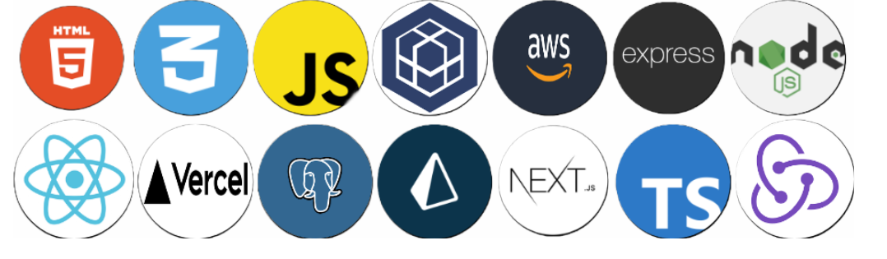

# Bienvenido a mi GitHub 👋

<h2>Hola mi Nombre es <b>Ezequiel</b> y soy Back end developer</h2>

#  
### Te invito a que le eches una hojeada a mi GitHub, cualquier cosita o un feedback que me quieras dar, te dejo abajo los link de contacto!!

 

  <h2>🧑‍💻 Tecnologias con las que estoy trabajando 🧑‍💻 </h2>
     &nbsp;&nbsp;&nbsp;&nbsp; 

  

  &nbsp;&nbsp;&nbsp;&nbsp; 
  &nbsp;&nbsp;&nbsp;&nbsp; 

#
# Proyectos

<h2 style="font-family: cursive;">◉<b><i> Healthy-Life</i></b></h2>

Es una App informativa de Recetas y Dietas, falta el deploy

   &nbsp;&nbsp;&nbsp;&nbsp; 
  &nbsp;&nbsp;&nbsp;&nbsp;&nbsp;&nbsp;&nbsp;&nbsp;&nbsp;&nbsp;&nbsp;&nbsp;  
 <h3>&nbsp;&nbsp;&nbsp;&nbsp;&nbsp;Repo</h3>
 

 

<h2 style="font-family: cursive;">◉<b><i> Sirun Patisserie</i></b></h2>

E-commerce orientado a la pasteleria y Panaderia

   &nbsp;&nbsp;&nbsp;&nbsp; 
  &nbsp;&nbsp;&nbsp;&nbsp;&nbsp;&nbsp;&nbsp;&nbsp;&nbsp;&nbsp;&nbsp;&nbsp;  
 <h3>&nbsp;&nbsp;&nbsp;&nbsp;&nbsp;Repo&nbsp;&nbsp;&nbsp;&nbsp;&nbsp;&nbsp;&nbsp;&nbsp;&nbsp;&nbsp;&nbsp;&nbsp;&nbsp;Deploy</h3>

 

<h2 style="font-family: cursive;">◉<b><i> Portfolio</i></b></h2>
   &nbsp;&nbsp;&nbsp;&nbsp; 
  &nbsp;&nbsp;&nbsp;&nbsp;&nbsp;&nbsp;&nbsp;&nbsp;&nbsp;&nbsp;&nbsp;&nbsp;  
 <h3>&nbsp;&nbsp;&nbsp;&nbsp;&nbsp;Repo&nbsp;&nbsp;&nbsp;&nbsp;&nbsp;&nbsp;&nbsp;&nbsp;&nbsp;&nbsp;&nbsp;&nbsp;&nbsp;Deploy</h3>

  

  

  <h2>Contacto</h2>
  
  &nbsp;&nbsp;&nbsp;&nbsp; 
  
    &nbsp;&nbsp;&nbsp;&nbsp; 
  

